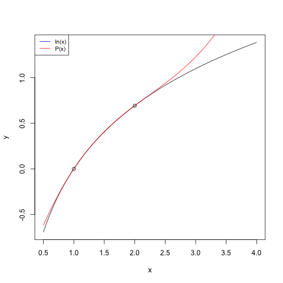

# 2

## a

Sea `f(x) = ln x` calcule un polinomio de interpolación Hermite de `f` en `x_0 = 1` y `x_1 = 2`

El código utilizado para calcular el polinomio de interpolación se encuentra en [hermite_interpolation](./hermite_interpolation). Donde `x` y `y` son los puntos por donde se quiere que pase la curva y `dy` la derivada que se quiere tener en esos puntos. El código utilizado es el siguiente:

```R
hermite_interpolation <- function(x,y,dy) {
	n <- length(x)
	D <- matrix(0,2*n,2*n)

	for (i in 1:n) {
		D[1,i*2-1] <- y[i]
		D[1,i*2] <- y[i]
		D[2,i*2-1] <- dy[i]
	}
	for (i in 1:(n-1)) {
		D[2,i*2] <- (D[1,i*2+1] - D[1,i*2])/(x[i+1] - x[i])
	}

	for (i in 3:(n*2)) {
		for (j in 1:(n*2-i+1)) {
			D[i,j] <- (D[i-1,j+1] - D[i-1,j])/( x[ceiling((i+j-1)/2)] - x[ceiling(j/2)] )
		}
	}
	x_ <- Sym('x')
	hermite_poly = y[1]
	mult_exp = expression(1)
	for (i in 2:(n*2)) {
		mult_exp = mult_exp*(x_ - x[ceiling((i-1)/2)])
		hermite_poly = hermite_poly + D[i,1]*mult_exp
	} 
	hermite_poly = Simplify(hermite_poly)
}
```

Realizando la interpolación con la función propuesta se tiene el 
 polinomio Hermite:

```
0.1137056388x^3 - 0.7616753749x^2 + 2.1822338332x - 1.5342640972
```

A continuación se muestran las gráficas del polinomio Hermite (rojo) y la función propuesta (negro) ademas de los puntos que se tomaron como referencia.



## b