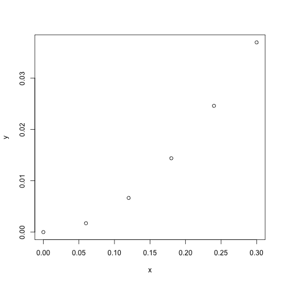

# 3

Suponga que tiene los siguientes datos de la función gamma `F(x,ß,α)`:

 X  | F(x,ß,α)
--- |---------
0   | 0
0.1 | 0.00467884
0.2 | 0.01752309
0.3 | 0.03613637
0.4 | 0.06155193

## <a name='a'></a>a

Gráfique `F(x,ß,α)` para varios valores de `x Є [0,1]` y con `ß = 1`, `α = 2`.


Los valores de gamma a graficar serán los siguientes:

 X   | F(x,ß,α)
-----|----------
0    | 0
0.06 | 0.0017295
0.12 | 0.0066491
0.18 | 0.0143811
0.24 | 0.0245814
0.30 | 0.0369363

Utilizando los puntos dados se tiene la siguiente gráfica:



## b

Estime `F(0.25)` utilizando el método de Neville. Utilice 7 cifras de redondeo.

El metodo de Neville propone un método para calcular un nuevo polinomio que pase por puntos dados a partir de polinomios anteriormente calculados evitando un gasto computacional al momento de agregar un nuevo punto.

se propone una función `neville(polynomials,x,y)` el cual recibe una función triangular inferior con los polinomios de neville calculados para ciertos puntos previamente calculados y el nuevo punto en las coordenadas `x` y `y`. 

```R
neville <- function(polynomials, x, y) {
	x_ <- Sym('x')
	if (is.null(polynomials)) {
		A <- matrix(Sym(0),1,2)
		m <- 0
	} else {
		m <- nrow(polynomials) 
		A <- matrix(Sym(0), m + 1, m + 2)
		A[1:m,1:(m+1)] <- polynomials
	}
	A[m+1,1] <- Sym(x) 
	A[m+1,2] <- Sym(y)
	if (m >= 1)
	for (i in 3:(m+2)) {
		A[m+1,i] <- ((x_ - A[m-i+3, 1])*A[m+1,i-1] - (x_ - A[m+1,1])*A[m,i-1]) / (Sym(A[m+1,1]) - Sym(A[m-i+3, 1]))
	}
	A
}
```


La función gamma en los valores de interes es `F(0.25,1,2) =  0.0264990` al generar los polinomios tenemos los siguientes valores con los datos elegidos en el punto [a](#a):

----------|------------|------------|------------|------------|-----------
0.0000000 |			   |			|			 |			  | 
0.0017295 | 0.00720625 | 			|			 |			  | 
0.0066491 | 0.01730823 | 0.02825205 |			 |			  | 
0.0143811 | 0.02340177 | 0.02695633 | 0.02645244 |			  | 
0.0245814 | 0.02628145 | 0.02652142 | 0.02649726 | 0.02649913 | 
0.0369363 | 0.02664055 | 0.02649092 | 0.02649940 | 0.02649895 | 0.02649898

