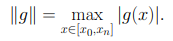
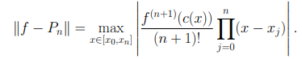
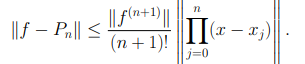

# Punto 4: Teorico

# Sea x0, x1, x2,...,xn valores distintos en el intervalo [a,b] Sea f(.) parte de C'+1 [a,b]

## f(x)-P(x) = ((f'+1  * E(x) ) / (n+1)!) (x-x0)(x-x1)(x-x2)...(x-xn)

## Respuesta:

Inspeccionando la formula dada es correcta cuando nuestro x es igual a xj y J=0,1,2,...,n sea x parte de (x0,xn) diferente de xj para j = 0,1,2,..,n, y para t sea parte de (x0,xn) consideremos la formula:

Esta es (n+1) veces difrenciable y se anula en los (n+2) puntos distintos x,x0,x1,x2,...,xn. De aqui una sucesiva aplicacion del teorema de Rolle conduce a la existencia de un punto c(x), comprendido entre x0 y xn tal que: , el resultado se obtiene mediante un simple cambio de terminos luego de derivar n+1 veces ambos lados y remplazar t por c(x).

Sea g una funcion continua definida en (x0,xn) definimos: 

Una medida aceptable del error que produce P respecto a f es precisamente:

Luego:

