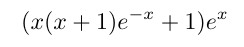
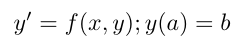
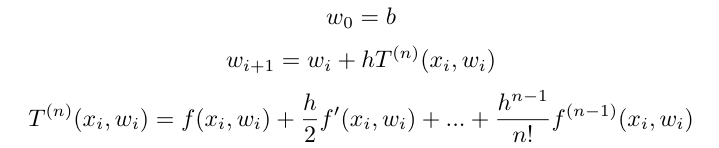

# 2. Método de Taylor

Obtenga cinco puntos de la solución de la ecuación, utilizando el método de Taylor (los
tres primeros términos) con `h = 0.1`

Grafique su solución y compare con la solución exacta, cuál es el error de truncamiento en cada
paso

## Desarrollo

La solución analítica de la ecuación se hace utilizando el código en [analitica.py](analitica.py), esté nos arroja que el resultado de la ecuación diferencial es de la siguiente forma:

En el método de Taylor se supone que se tiene un problema de la forma:

Y la solución es una recursión de la forma:

Para el problema propuesto se tiene que:

Utilizando los tres primeros terminos de la serie además se tiene que:

Ambos resultados se pueden apreciar en la siguiente gráfica. Donde la linea azul es la solución por el método de Taylor, y la naranja es la solución analítica:

Los errores que presenta el método de Taylor se puede apreciar en la siguiente tabla:

x | error 
---- | -----
0 | 0.0 |
0.2 | 0.0 |
0.4 | 0.0 |
0.6 | 1.11e-16 |
0.8 | 1.11e-16 |
1.0 | 1.11e-16 |
1.2 | 2.22e-16 |
1.4 | 0.0 |
1.6 | 2.22e-16 |
1.8 | 4.44e-16 |
2.0 | 4.44e-16 |
