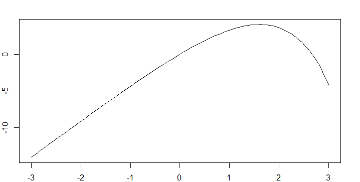

Se propone resolver la ecuacion integral entre 0 y x de: (5-e^u)du = 2 con el
# Método del punto fijo.

a.) Mediante un gráfico aproximado, o evaluando directamente, localice las raíces
reales.

b.) Mediante un gráfico aproximado, evaluando directamente, localice las raices 
reales.

c.) Proponga una ecuación equivalente x= g(x) y determine el intervalo de
convergencia para calcular una de las dos raices.

d.) Del intervalo anterior, elija un valor inicial y realice 5 iteraciones. En
cada iteración verifique que se cumpla la condición de convergencial del punto fijp
y estime el error de truncamiento en el ultimo resultado.

## Analisis 


a.) Luego de resolver la integral se obtiene que f(x) = 5x + e^x - 1, con este 
valor es posible trabajar en los puntos siguientes.

b.) Usando la funcion f(x) obtenida previamente se opto por graficar para 
obtener las raices reales de la funcion, la grafica obtenida fue la siguiente:



Esta grafica fue obtenida utilizando R en el archivo graph.R.

Luego de analizar la grafica, es posible decir que las raices reales se encuentran en
aproximadamente 2,66 y 0.

c.) Para obtemer el intervalo y las respectivas iteraciones fue utilizado el metodo
del punto fijo expresado de la siguiente manera:

```
from math import *
def g(x):

    y=5*x+e^x-1

    return y

p0=0

tol=0.001

n0=5

i=1

while i<=n0:

    p=g(p0)

    if abs(p-p0)<tol:

        print("El punto fijo es ",p," despues de ",i," iteraciones")

        break

    i=i+1

    p0=p

if i>n0:

    
    print("El metodo no converge ")
    
```

